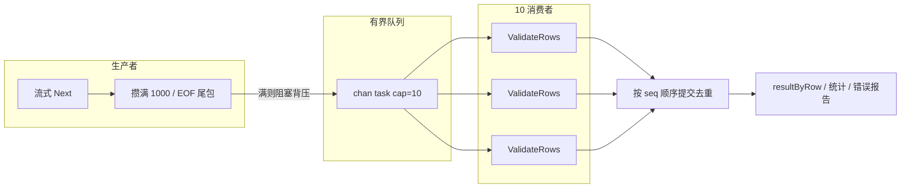

# ValidateDispatchFile 大文件校验

口径：手动下发导入，单文件上限 **1MB** / 约 **10 万行**。

## 背景

手动下发支持客经上传 Excel（UID / 客户编号 + 场景字段），后端要完成：

1. 下载并解析文件  
2. 调 customer 批量校验行合法性（权限、客户存在等）  
3. 行间去重、汇总统计  
4. 有错误时生成并上传错误报告 xlsx  
5. 提交审批时二次校验 + 提 OA  

链路跨 **operation / customer / file / progress / BFF / 前端**，大文件下一轮就是分钟级，且会同时吃内存与下游 RPC。

## 原因

大文件下主要矛盾有三类：

| 矛盾 | 表现 |
|------|------|
| **峰值内存** | 若整表解析进内存，~10 万行 + 单元格网格会把单次请求内存顶很高，影响同机其他流量 |
| **校验吞吐** | customer 批量接口适合「约 1000 行 × 多路并发」；若批与批之间串行等待，~10 万行会变成约 100 次串行 RPC，耗时轻易顶穿网关 50s |
| **长耗时绑同步接口** | 即使流水线打满，校验本身可达数十秒；全错时错误报告再 +30s 量级。同步 RPC / BFF / 网关超时会直接失败，用户只看到超时 |

因此要同时解决：**少占内存、打满并发、别让用户卡在一次 HTTP 上**。

## 处理方案

目标：**控峰值内存**、**打满 customer 校验并发**，并把长耗时（含错误报告）挪出同步接口。

### 1. 流式解析 + 双缓冲校验队列

| 点 | 约定 |
|----|------|
| 读 Excel | 流式逐行，不整表进内存 |
| 批大小 | 满 **1000** 行投一次任务（EOF 尾包不足 1000 也投） |
| 队列 | `chan` cap=**10**，满则生产者阻塞（背压） |
| 消费者 | **10** 路并行调 `ValidateRows`（customer 批量校验） |
| 去重 | RPC 可乱序完成，按投递 **seq** 顺序提交后再去重，保证行出现顺序语义 |
| 错误报告 | 有行错误时二次流式扫文件生成 xlsx 并上传；全错时报告本身也可达数十秒 |

效果：解析与校验 **重叠**；内存大致只常驻「队列缓冲 + 在途」×1000 行（约 **2 万行** 任务量级），无整表网格。CPU 峰值不是优化目标——更像持续打满 10 路 I/O + 本地解析。

### 2. 异步创建 + 进度轮询

校验（含错误报告）与提交审批都走异步：

1. `AsyncValidateDispatchFile` / `AsyncSubmitDispatchApproval` → `CreateProgress` → 立刻回 `task_id`  
2. worker（`goroutinepool`，耗时上限约 3min）跑完整链路，`EndProgress` 把结果写入 `extra_msg` JSON  
3. 前端每 **3s** 查 `progress/detail`，直到非 Processing  

| 终态 | 含义 |
|------|------|
| Success + `extra_msg` JSON | 校验跑完（`pass=true/false` 都算成功业务结果）；提交成功带 `approval_id` 等 |
| UserException | 提交业务失败（参数 / OA 等） |
| SysException | 基建失败（下载 / RPC / DB 等） |

同员工同团队同类型任务用 `lock_key` 互斥；撞锁时对用户提示「当前有校验/提交正在处理中，请等待完成后再试」。

创建接口短超时（约 10s）；BFF `GET /api/progress/detail` 透传进度服务。

### 3. 量级（同口径）

设单批 1000 行 customer RPC 耗时为 `T`：

| 项 | 量级 |
|----|------|
| 有效校验耗时（10 路打满） | ≈ `10 × T` |
| Excel 流式解析（含日期规范化） | 约数秒，叠进流水线 |
| 峰值内存（行缓冲） | ~(10+10)×1000 ≈ **2 万行** 任务常驻 |
| 全错 1MB（mock 行校验 + 报告） | 单测约 9～10s 量级，真实 customer + 大报告更长 → 靠轮询扛 |

别踩：批大小仍是 1000，但若改成「满 1000 **同步等完再读下一批**」，会变成约 100 次串行 RPC，易 ≥50s 网关超时。问题在并发被拆掉，不在流式本身。

## 拓展思考

1. **内存 vs CPU**  
   双缓冲主要换的是峰值内存，不是 CPU 尖峰。解析与 10 路校验重叠后，CPU 更偏「持续忙」。若以后要压 CPU，方向会是解析减负（日期规范化）、下游批量更大、或限流同机并发任务数，而不是再砍队列。

2. **错误报告仍是重活**  
   全错时几乎要按「全文件 × 结果列」重写 xlsx。异步只是不挡创建接口；报告本身仍占 worker 时间与临时内存（`resultByRow` 等）。若产品允许「仅抽前 N 条错误」或「分片报告」，还能再砍一截。

3. **进程内异步的边界**  
   `goroutinepool` 与 customer 批量同级：进程重启会丢进行中任务，依赖 progress 超时终态。首期可接受；若要强可靠，才值得上独立 MQ / 可恢复任务表（审批通过后的 `dispatch_approval` 队列仍只服务建项，不要混用）。

4. **进度条体验**  
   当前创建时 `total` 可为 0，终态前多为 indeterminate；若要百分比，需在流水线按窗 `IncrProgress`，并约定 total 估算口径（总行数要等解析完才准）。

5. **参数怎么调**  
   `1000` 对齐 customer 批量习惯；`10` 对齐其内部并发感。再加大队列/消费者会抬内存与对 customer 的瞬时压力，需要和下游一起压测，而不是单边调大。

6. **可复用面**  
   「流式生产 + 有界队列 + 有序提交」适合其他「大文件 → 多批下游 RPC」场景；「AsyncRsp + progress 轮询」已与大客批量导入同范式，新增长任务优先复用，避免再造一套任务中心。

## 一句话

**流式 + 有界队列打满 10 路校验控内存保吞吐；长链路异步轮询，别让同步接口扛错误报告。**
